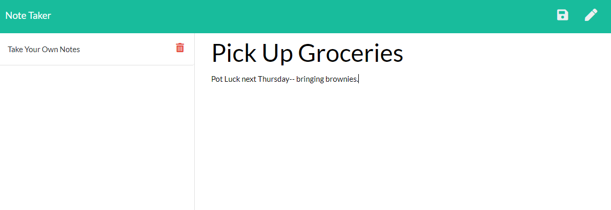
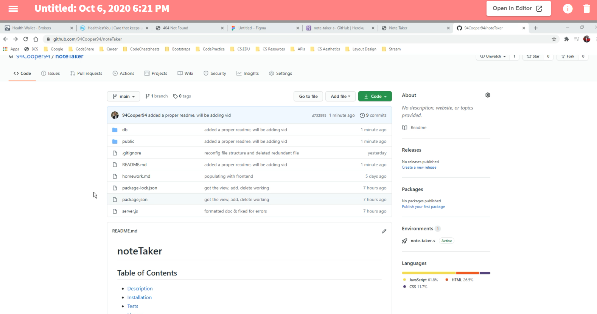

# noteTaker

## Table of Contents
- [Description](#description)
- [Installation](#installation)
- [Tests](#tests)
- [License](#license)
- [Technology](#technology)
- [Contributors](#contributors)

## Description
  For users that need to keep track of a lot of information. Heroku's constant uptime enables users to take persistent notes allowing to have written information available when needed.

## Installation
Required packages: Simply follow the deployed link!
  
## Tests
To test, run the following command: Clicking the link and starring the page

## License
MIT

## Technology
JavaScript, jQuery, JSON, node.js, express.js, Heroku, GitHub

## Contributors
Cooper Ahearn

## Contact

View the project live thanks to GitHub Pages: https://note-taker-s.herokuapp.com/

For a step by step video:

If you have any questions, contact the author directly at LCAhearn94@gmail.com.